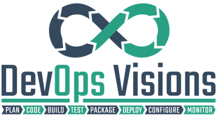

# DevOps Step-By-Step

  

- [⬇️ Introduction to Information Technology](/source/introduction-to-information-technology/ "Introduction to Information Technology")

  - [⚠️ Course Info and Prerequisites](/source/introduction-to-information-technology/source/it-info-prerequisite.md "Course Info and Prerequisites")

  - [📃 Course Outlines](/source/introduction-to-information-technology/source/it-outline.md "Course Outlines")

  - [❓ Course FAQ](/source/introduction-to-information-technology/source/it-faq.md "Course FAQ")

- [⬇️ Fundamentals of Modern Software Engineering and DevOps](/source/advanced-introduction-to-devops/ "Advanced Introduction to DevOps")

  - [⚠️ Course Info and Prerequisites](/source/advanced-introduction-to-devops/source/devops-info-prerequisite.md "Course Info and Prerequisites")

  - [📃 Course Outlines](/source/advanced-introduction-to-devops/source/devops-outline.md "Course Outlines")

  - [🔖 Course Lessons Outcomes](/source/advanced-introduction-to-devops/source/devops-lessons-outcomes.md "Course Lessons Outcomes")

  - [🧪 Course Demos/Labs](/source/advanced-introduction-to-devops/source/devops-demos-labs.md "Course Demos/Labs")

  - [📝 Course Preparation Points](/source/advanced-introduction-to-devops/source/devops-lessons-preparation.md "Course Preparation Points")

  - [❓ Course FAQ](/source/advanced-introduction-to-devops/source/devops-faq.md "Course FAQ")

- [⬇️ Mastering Microsoft DevOps Solutions (Get Certified)](/source/mastering-microsoft-devops-solutions/ "Mastering Microsoft DevOps Solutions (Get Certified)")

  - [⚠️ Course Info and Prerequisites](/source/mastering-microsoft-devops-solutions/source/microsoft-devops-info-prerequisite.md "Course Info and Prerequisites")

  - [📃 Course Outlines](/source/mastering-microsoft-devops-solutions/source/microsoft-devops-outline.md "Course Outlines")

  - [🔖 Course Lessons Outcomes](/source/mastering-microsoft-devops-solutions/source/microsoft-devops-lessons-outcomes.md "Course Lessons Outcomes")

  - [🧪 Course Demos/Labs](/source/mastering-microsoft-devops-solutions/source/microsoft-devops-demos-labs.md "Course Demos/Labs")

  - [📝 Course Preparation Points](/source/mastering-microsoft-devops-solutions/source/microsoft-devops-lessons-preparation.md "Course Preparation Points")

  - [❓ Course FAQ](/source/mastering-microsoft-devops-solutions/source/microsoft-devops-faq.md "Course FAQ")

- [⬇️ Mastering Terraform (Get Certified)](source/mastering-terraform/ "Mastering Terraform (Get Certified)")

  - [📃 Course Outlines](/source/mastering-terraform/terraform-outline.md "Course Outlines")

- [📑 Source Code](/source/source-code/ "Source Code/Labs")

- [🎯 Guides](/source/docs/ "Guides")

- [❓ General FAQ](/source/faq.md "FAQ")

- [🙋‍♀️ Q/A](http://devopsvisionsqa.mohamedradwan.com/ "Q/A")

- [⭐ Reviews (Individuals)](/source/review-individuals.md "Click here to See Members Reviews")

- [⭐ Reviews (Corporates)](/source/review-corporates.md "Click here to See Corporates Reviews")

- [📅 Course Schedule](/source/course-schedule.md "Course Schedule")

- [💰 Prices](/source/service-prices.md "Service Prices")

- [📝 Terms & Conditions](/source/terms-conditions.md "Terms & Conditions")

- [📜 Return Policy](/source/cancel-return-policy.md "Return Policy")
 
- [💪 Mentoring Service](/source/mentoring-service.md "Mentoring Service")

- [📅 Events Schedule](/source/events-schedule.md "Events Schedule")

- [👪 Community Gathering](/source/community-gathering.md/ "Community Gathering")

- [❤️ Contribution](/source/contribution/ "Contribution")

- [▶ Subscribe to our channel (English)](https://www.youtube.com/user/MRadwanMSF?sub_confirmation=1 "Subscribe to Mohamed's YouTube Channel")

- [▶ Subscribe to our channel (Arabic)](https://www.youtube.com/c/MohamedRadwanArabic?sub_confirmation=1 "Subscribe to Mohamed's YouTube Channel")

## Connect with me
  
  &ensp;
  
  &ensp;
  
  &ensp;
  
  &ensp;
  
  &ensp;
  
  &ensp;
  

## Thanks to all our contributors ❤️

## Star History

