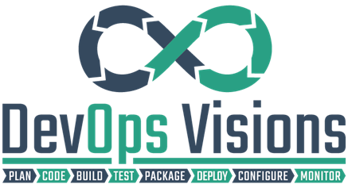

# DevOps Step-By-Step

 

 
 

## **Foundation of the DevOps Step-By-Step Roadmap and Vision**

 This repository represents the foundation of **DevOps Step-By-Step**. It brings together the roadmap, structured learning paths, course outlines, hands-on labs, and supporting materials that define the vision and provide a clear, step-by-step progression for learners and practitioners.

We also launched additional platforms to extend our mentorship and community experience. These spaces help us scale collaboration, enable broader contribution, and create more room for community projects, technical articles, and mentorship-focused engagement while keeping this repository as the central reference point for the roadmap and learning content.

Explore the extended ecosystem below.

---

## 🌐 The Extended Ecosystem

As the **DevOps Step-By-Step** initiative grew, we created additional spaces that help us scale mentorship, community collaboration, and publishing. These platforms work together with this repository to provide a broader experience: structured learning here, and expanded engagement through dedicated hubs.

### 1️⃣ Elmentor Program (Mentorship)
*A dedicated mentorship space designed to deliver guided learning, structured support, and focused coaching paths. It complements the learning roadmap in this repository by offering a more interactive mentorship experience for individuals and teams.*
* 🌐 **Official Website:** [elmentorprogram.com](http://elmentorprogram.com/)
* 🐙 **GitHub Organization:** [github.com/ElmentorProgram](https://github.com/ElmentorProgram)
* A dedicated space for mentorship and structured guidance that complements the roadmap in this repository.

### 2️⃣ DevOps Visions (Community & Blog)
*A community hub for open source collaboration and technical publishing. It’s where we share articles, patterns, and project work that grow out of the roadmap and training materials in this repository, and where contributors can participate in building and improving community-driven initiatives.*
* ✍️ **Technical Blog:** [devopsvisions.github.io/blog/](https://devopsvisions.github.io/blog/)
* 🐙 **GitHub Organization:** [github.com/DevOpsVisions](https://github.com/DevOpsVisions)
* A community space for articles and open source collaboration connected to the learning journey here.

---

## 🎓 Course Curriculum

Explore the structured learning paths and materials below, organized to guide you from fundamentals to advanced topics through clear outlines, outcomes, and hands-on practice.

### ⬇️ Introduction to Information Technology (Start Here)
A practical starting point that builds the essential IT foundation needed before moving into DevOps and modern software engineering topics.
* **Start Here:** [⚠️ Course Info and Prerequisites](/source/introduction-to-information-technology/source/it-info-prerequisite.md)
* **Curriculum:** [📃 Course Outlines](/source/introduction-to-information-technology/source/it-outline.md)
* **Help:** [❓ Course FAQ](/source/introduction-to-information-technology/source/it-faq.md)
* [📂 **View Full Folder**](/source/introduction-to-information-technology/)

### ⬇️ Fundamentals of Modern Software Engineering and DevOps
A structured path that connects engineering fundamentals with practical DevOps workflows, helping you understand how modern teams build, deliver, and operate software with confidence.
* **Start Here:** [⚠️ Course Info and Prerequisites](/source/advanced-introduction-to-devops/source/devops-info-prerequisite.md) • [📝 Prep Points](/source/advanced-introduction-to-devops/source/devops-lessons-preparation.md)
* **Curriculum:** [📃 Course Outlines](/source/advanced-introduction-to-devops/source/devops-outline.md) • [🔖 Lessons Outcomes](/source/advanced-introduction-to-devops/source/devops-lessons-outcomes.md)
* **Hands-on:** [🧪 Course Demos/Labs](/source/advanced-introduction-to-devops/source/devops-demos-labs.md)
* **Help:** [❓ Course FAQ](/source/advanced-introduction-to-devops/source/devops-faq.md)
* [📂 **View Full Folder**](/source/advanced-introduction-to-devops/)

### ⬇️ Mastering Microsoft DevOps Solutions (Get Certified)
A certification-oriented learning path focused on Microsoft DevOps practices, Azure DevOps capabilities, and real-world implementation patterns, supported by outlines, outcomes, and hands-on demos.
* **Start Here:** [⚠️ Course Info and Prerequisites](/source/mastering-microsoft-devops-solutions/source/microsoft-devops-info-prerequisite.md) • [📝 Prep Points](/source/mastering-microsoft-devops-solutions/source/microsoft-devops-lessons-preparation.md)
* **Curriculum:** [📃 Course Outlines](/source/mastering-microsoft-devops-solutions/source/microsoft-devops-outline.md) • [🔖 Lessons Outcomes](/source/mastering-microsoft-devops-solutions/source/microsoft-devops-lessons-outcomes.md)
* **Hands-on:** [🧪 Course Demos/Labs](/source/mastering-microsoft-devops-solutions/source/microsoft-devops-demos-labs.md)
* **Help:** [❓ Course FAQ](/source/mastering-microsoft-devops-solutions/source/microsoft-devops-faq.md)
* [📂 **View Full Folder**](/source/mastering-microsoft-devops-solutions/)

### ⬇️ Mastering Terraform (Get Certified)
A guided path for learning Terraform concepts and building practical infrastructure-as-code skills, with a curriculum outline designed to support both real projects and certification preparation.
* **Curriculum:** [📃 Course Outlines](source/mastering-terraform/source/terraform-outline.md)
* [📂 **View Full Folder**](source/mastering-terraform/)

---

## 🚀 Community Resources
Helpful links for mentorship details, contribution guidance, and community learning assets connected to the DevOps Step-By-Step ecosystem.

### 💪 Mentoring Service Details
If you are looking for mentorship, structured guidance, or program enrollment, use the Elmentor Program platform for the most up-to-date details and mentorship experience.
* [📃 Conditions](/source/mentoring-service/source/conditions.md) • [📅 Agenda](/source/mentoring-service/source/agenda.md) • [📅 Schedule](/source/mentoring-service/source/events-schedule.md)
* [👪 Community Gathering](/source/mentoring-service/source/community-gathering.md) • [💭 Mindmap](source/mentoring-service/source/mind-map.md)

### ❤️ Contribution
This initiative grows through community effort. If you want to contribute improvements, new demos, fixes, or enhancements to the learning materials, use the resources below to align with the project style and structure.
* [🔎 Contribution Culture](/source/contribution/source/contribution-culture.md) • [💡 How to contribute?](/source/contribution/source/how-to-contribute.md)
* [🎯 Guidelines to write Q/A Demos](/source/contribution/source/Guidlines-to-write-Q-A-demos.md) • [📑 Q/A Template](/source/contribution/assets/templates/)

### 📰 News Archive
* [🗞️ News 2025](/source/news/source/news-2025.md) • [🗞️ News 2024](/source/news/source/news-2024.md) • [🗞️ News 2023](/source/news/source/news-2023.md)

---

## 📚 General Support
Quick access to documentation, FAQs, schedules, policies, and references to help you navigate the materials and stay aligned with how the initiative is organized.

**Documentation**
* [🎯 Guides](/source/docs/) • [📑 Source Code/Labs](/source/source-code/) • [❓ General FAQ](/source/faq.md)

**Reviews**
* [⭐ Individuals Reviews](/source/review-individuals.md) • [⭐ Corporates Reviews](/source/review-corporates.md)

**Administrative**
* [📅 Course Schedule](/source/course-schedule.md) • [💰 Prices](/source/service-prices.md) • [📝 Terms & Conditions](/source/terms-conditions.md) • [📜 Return Policy](/source/cancel-return-policy.md)

**Subscribe**
* [▶ English Channel](https://www.youtube.com/user/MRadwanMSF?sub_confirmation=1) • [▶ Arabic Channel](https://www.youtube.com/c/MohamedRadwanArabic?sub_confirmation=1)

---

## Connect with me

  
  &ensp;
  
  &ensp;
  
  &ensp;
  
  &ensp;
  
  &ensp;
  
  &ensp;
  

## Thanks to all our contributors ❤️
Your contributions help improve the roadmap, strengthen the materials, and keep the learning experience evolving through community collaboration.

## Star History
A quick view of how the community has grown around the DevOps Step-By-Step repository over time.

