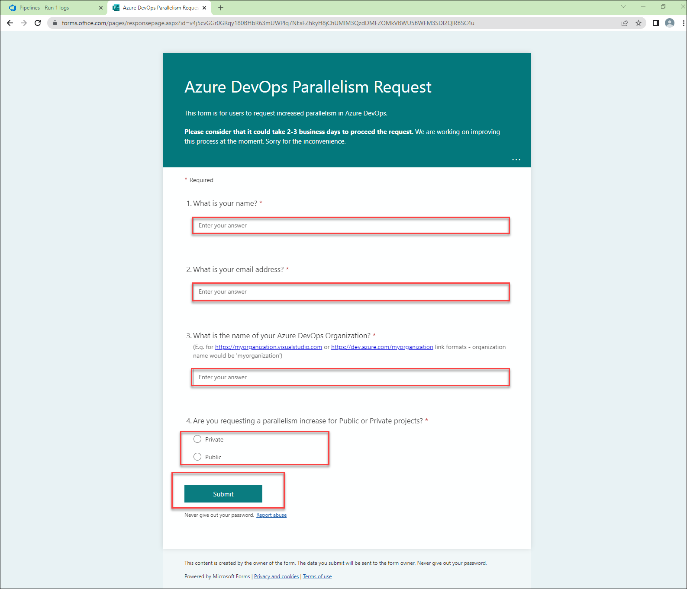
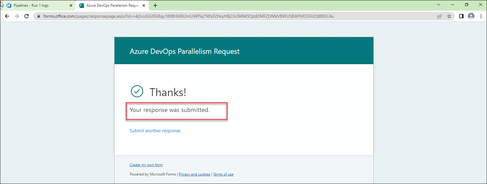
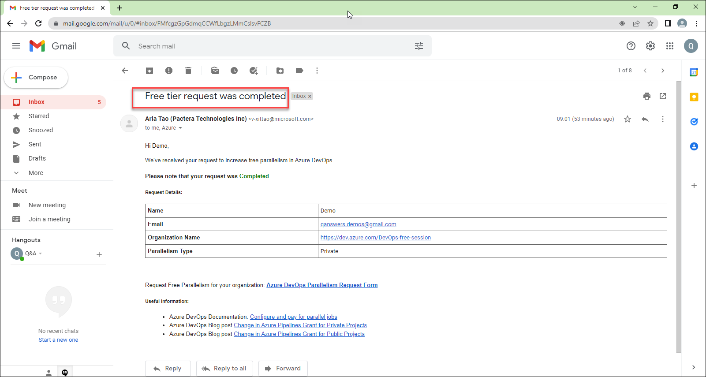
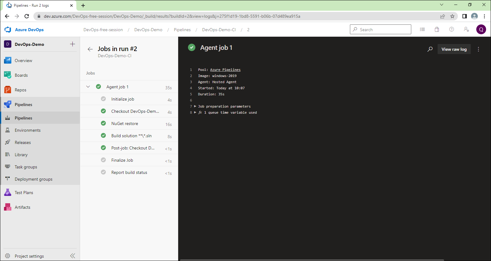

# Request a free Azure DevOps Parallelism Grant

Microsoft has temporarily disabled the free grant of parallel jobs for public projects and for certain private projects in new organizations. However, you can request this grant by submitting a request.

Here are the steps of requesting a free Azure DevOps parallelism grant.

1- For a new Azure DevOps Organization your first build pipeline will fail

2- You need to request a free Azure DevOps parallelism grant.

3- Visit this <a href="https://aka.ms/azpipelines-parallelism-request">Link</a> 

4- Fill out the following form 

**Note:** Your organization name in the Organization name field must be a link format like this 
https://yourorganization.visualstudio.com or https://dev.azure.com/yourorganization 

5- Your form submitted successfully

6- It will take 2-3 business days to respond to your free tier requests.

7- You will recieve an email that your request was completed

8- Now your build will success 

