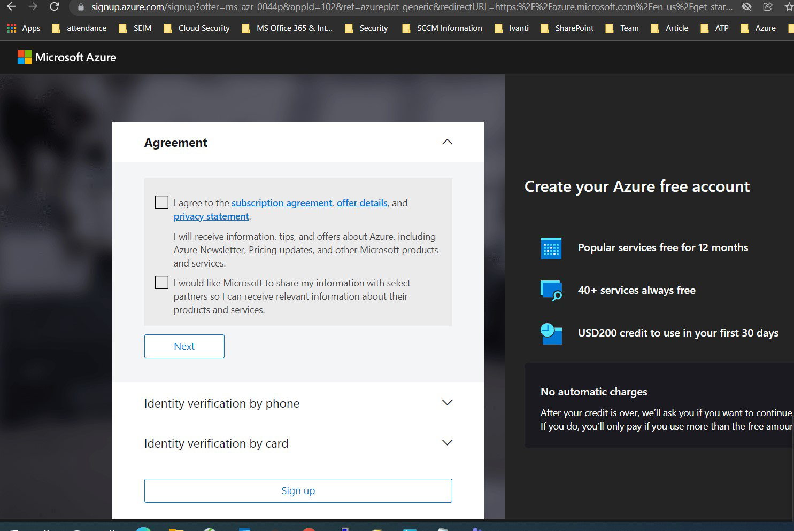
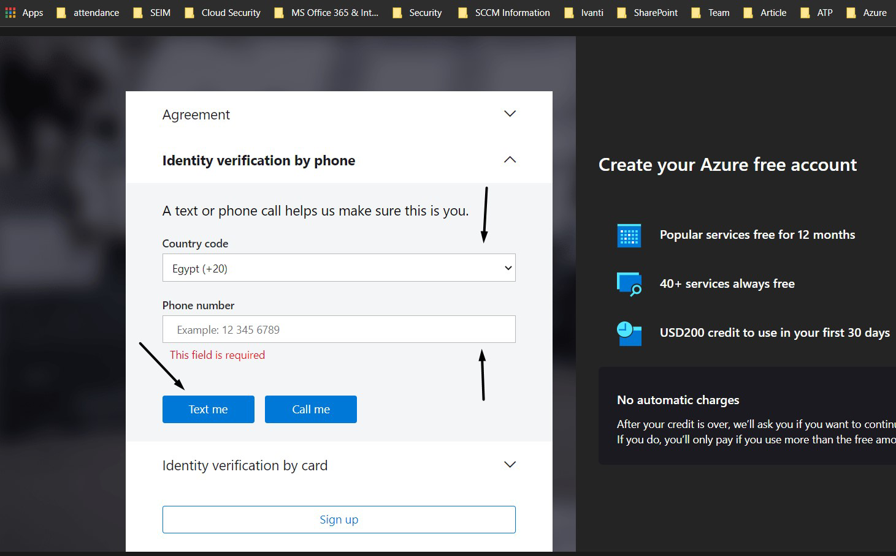
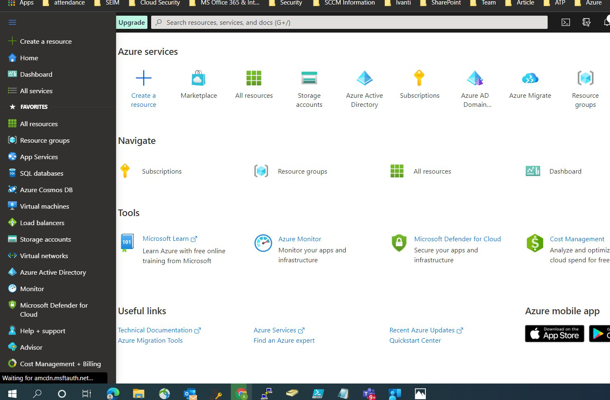

# Create an Azure Subscription free account

1- Go to this link https://azure.microsoft.com/en-us/free/

2-Check the box for Agreement and then press Next

3-Fill in your contact information and then press TEXT Me to verify this information

4-To Identity verification, Write the code that you got on your mobile

5-Fill in your credit card information

6-Sign up and Start with Azure Portal

7-Welcome to your subscription and enjoy!

