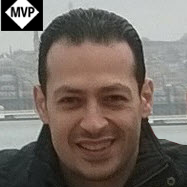

# About Our Guest Speakers

Luke Killick
=============

Bio
---

Luke is a Senior Recruiter in the UK, he falls into recruitment after university, starting in the contracting markets and moving into the permanent world. This followed a mixed bag of sales roles which, as it turns out, applies pretty well to recruitment and resourcing. His professional interests include sales, recruiting strategy, and tech.

  

Mohamed Moshrif
=============

Bio
---

Mohamed Moshrif is an Engineering Manager @Google, Ex-Amazon, Ex-Microsoft, Ex-Booking.com. 

Mohamed got over 19 years of combined diverse experience under my belt that spans all aspects of software development whether it's technical, business, managerial or educational.

In the last couple of years, he helped multiple international businesses to open local branches in Egypt to give the same quality of work with much lower costs, helped them build teams and branches from scratch including day to day responsibilities of running a complete business.

  

Chafik Belhaoues
=============

Bio
---

Chafik is the founder of Brainboard, he is an engineer with more than 15 years of experience building and managing cloud infrastructures (on-prem and in the cloud). He worked on different positions DevOps, SRE and cloud architecture and before starting his own company he was the CTO of Scaleway (French cloud provider).

  

Mohamed Radwan
=============

Bio
---

Mohamed is Azure DevOps/GitHub MVP specializing in DevOps Practices, Technologies, Agile and Azure Platform. Over the course of 20 years, Mohamed has helped over 60 enterprise companies based around the globe some of them from the Fortune 500, including the UK, Denmark, USA, France, among others. 

He has a huge passion for automation with professional experience spanning the different stages and phases of Software Development Lifecycle. he has authored many technical guides, papers, and automation frameworks published on GitHub, Azure DevOps Marketplace, and other technical communities. He also provided other contributions to technical communities like MSDN, Stack Overflow, and many others. He has frequently spoken at many technology conferences and events such as Microsoft Tech Days UK, Microsoft Ignite the Tour in London, Campus Days in Denmark, and Microsoft Open Days in Egypt, among others.

Mohamed has a YouTube channel and blog where they have hundreds of videos and articles with thousands of subscribers and millions of views from all over the globe.

  

Guy Morley
=============

Bio
---

Guy is a Managing Director With the help of his team he is responsible for strategy, staff management & direction, sales & marketing, financial control & management, training & development and recruitment. He is also personally responsible for managing and supporting their strategically important clients and business development. 

  