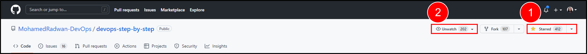

## How to join CE (Community Edition) of DevOps Course 🎓?

1.Register in the CE (Community Edition) [form](https://github.com/MohamedRadwan-DevOps/devops-step-by-step/blob/main/source/faq.md#where-or-how-can-i-register).

2.Star the repo (click the star) and Watch the repo (click watch for all activities).
 
 

 
 
3.Watch all the previous videos for the CE on our [YouTube Channel](https://www.youtube.com/user/MRadwanMSF).

4.Review the [Issues](https://github.com/MohamedRadwan-DevOps/devops-step-by-step/issues) and the [FAQ Page](https://github.com/MohamedRadwan-DevOps/devops-step-by-step/blob/main/source/faq.md).

5.Review the repo very well and be aware of all the content in it.

6.Review the [course outline](https://github.com/MohamedRadwan-DevOps/devops-step-by-step/blob/main/source/devops-course-outline.md), lesson description (coming soon), [preparation points](https://github.com/MohamedRadwan-DevOps/devops-step-by-step/blob/main/source/devops-course-lessons-preparation.md), and [demo labs](https://github.com/MohamedRadwan-DevOps/devops-step-by-step/blob/main/source/devops-course-demos-labs.md) pages.

7.Practice what you learned to achieve all the outcomes.

8.If you have any issues or inquiries, raise an [issue](https://github.com/MohamedRadwan-DevOps/devops-step-by-step/issues) on GitHub but make sure it's not repeated in the [closed issues](https://github.com/MohamedRadwan-DevOps/devops-step-by-step/issues?q=is%3Aissue+is%3Aclosed) or [FAQ Page](https://github.com/MohamedRadwan-DevOps/devops-step-by-step/blob/main/source/faq.md).

9.Attend the free sessions and ask about any problems that you face in accordance to our Code of Conduct.
