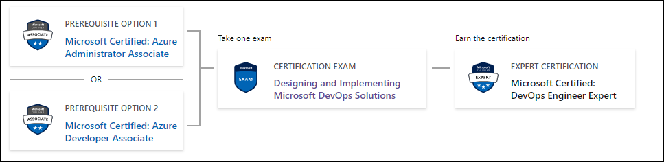

# Mastering Microsoft DevOps Solutions (Get Certified)

## Frequently Asked Questions (FAQ) and  Code of Conduct (CoC)
  - [If I attend the course and pass AZ-400 exam, doest it mean I will get the Microsoft Certified: DevOps Engineer Expert?](#if-i-attend-the-course-and-pass-az-400-exam-doest-it-mean-i-will-get-the-microsoft-certified-devops-engineer-expert)
  - [Do I have to take Microsoft Certified Azure Administrator Associate or  Microsoft Certified Azure Developer Associate exam before take AZ 400 exam?](#do-i-have-to-take-microsoft-certified-azure-administrator-associate-or--microsoft-certified-azure-developer-associate-exam-before-take-az-400-exam)
  - [What are the prerequisites of the course?](#what-are-the-prerequisites-of-the-course)

## If I attend the course and pass AZ-400 exam, doest it mean I will get the Microsoft Certified: DevOps Engineer Expert?

To become a Microsoft Certified: DevOps Engineer Expert, you must pass additional exam to AZ-400 which is at least one of the following: 
- [Microsoft Certified: Azure Administrator Associate](https://learn.microsoft.com/en-us/certifications/azure-administrator/).
- [Microsoft Certified: Azure Developer Associate certification](https://learn.microsoft.com/en-us/certifications/azure-developer/).

## Do I have to take Microsoft Certified Azure Administrator Associate or  Microsoft Certified Azure Developer Associate exam before take AZ 400 exam?

No, you can take AZ-400 exam first then take the other exam later. 

## What are the prerequisites of the course?

You can review all the prerequisites of the course on the following link:

[Course prerequisites](microsoft-devops-info-prerequisite.md)

**[⬆ back to top](#mastering-microsoft-devops-solutions-get-certified)**
