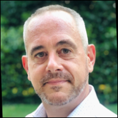

# DevOps CoP (Community of Practice)

    

## Schedule for our CoP/CoE/Mentor
More info about our Public Calendar and other events ([click here](https://calendar.google.com/calendar/u/0?cid=YTE5NjZmM2NmZjhjNTUzYzBhYmMzODhmZWQxYzdjNzFhZTdkNzcwODc1NDQ2ZjkyYTFkYjRiODRmNGFmNDM2YUBncm91cC5jYWxlbmRhci5nb29nbGUuY29t))

**All the time slots are provided in UK/London time.**

| Date    | Time    |    Session Title| Speaker |   Pic    |
| --------|-------- | ----------------| --------|----------|
| 08 August 2022| 16:00 - 17:00  | The easy way to make your job application stand out from the rest | [Luke Killick](events-speakers.md#luke-killick) ||
| 07 September 2022| 19:00 - 20:30  | Mock and simulation of Software Engineers interviews| [Mohamed Moshrif](events-speakers.md#mohamed-moshrif) |  |
| 03 October 2022|  19:00 - 20:30  | Modern way to build and manage Infrastructure-as-Code: visually | [Chafik Belhaoues](events-speakers.md#chafik-belhaoues) | |
| 02 November 2022| 19:00 - 20:30  | Ask Me Anything | [Mohamed Radwan](events-speakers.md#mohamed-radwan) | |
| 11 July 2023| 18:00 - 19:30  | The Secret to Success with Anthony Mashford & Mohamed Radwan | [Anthony Mashford](events-speakers.md#anthony-mashford) | |
| 09 Nov 2023| 19:00 - 20:30  | The Secret to Success with Michael Blumenthal & Mohamed Radwan| [Michael Blumenthal](events-speakers.md#michael-blumenthal) | |

# The Secret to Success with MVPs

