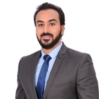
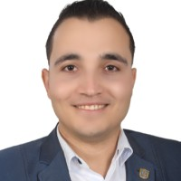
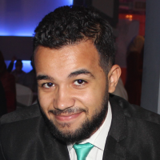

# Course Reviews (Individuals)

## Kareem Khamis
## Shifting Career to DevOps/USA

Hi, my name is Kareem Khamis, currently residing in USA, I wanted to do a quick review on Mohamed Radwan's DevOps Course.

I was in the first batch attending the course, I am considered one of the people who are shifting their career to DevOps, I will briefly try to explain my fondness with the course. 

I liked the course because of 2 reasons:
	The first reason is: DevOps as a field.
	The second reason is: Mentoring and Support Program. 

The course was a detailed roadmap for the DevOps Career, the course taught me what to learn, when to learn it, and how to apply what I learn practically; And this is the Course's Strongest Suit. I did not see this in any other course,specially in the DevOps Field.

Most of the other courses usually delve right away into Technology or Tools, where as with Mohamed Radwan, I learned Architecture from scratch, and he explained the definitions and practices in detail.

By following this path, it made me technology and tool Agnostic, and this gave me the flexibility to learn any new tool whenever I want it.

Now for the second part, the community on the Q&A Platform, really helped me solve any issue I faced when solving the assignment, wether it be from Mohamed Radwan Personally or any one in the course!

The final point which I will discuss is the Mentorship program, Mohamed Radwan's Thinking and directives are very practical.

Let me give you an example to clarify, one of the traits he hammered into us in this age of informational chaos, is Priority Setting!

This taught me what and when to learn, and how to maximize the benefit of what I learned, and this saved alot of effort and time!

And thus Priority setting has become a staple in my everyday life.

Currently, I am continuing with Mohamed Radwan in the Mentoring and Technical Support program, and I want to close by saying Thank you Mohamed Radwan and Good Luck!

Reviewer's Video (Arabic)

 &ensp; 

### Connect with Kareem: &ensp; 
 &ensp; 

  

## Mahmoud Mohamed Elsayed
## Software Development Team Lead/KSA

Hi, I am Mahmoud Mohamed Elsayed, Software Development Team Lead, currently residing in Riyad, KSA.

I wanted to give a quick review about Mohamed Radwan's DevOps Course.

The course states that it is an Introduction to DevOps, however the course is much more than that!

The course starts by teaching you how to write code, how to write unit tests,and what is coverage, and then continues on teaching you how to upload packages to NuGet, and then using packages for CI/CD, proceeded by how to use the cloud, and how to provision infrastructure using terraform, and finally how to work within a team, which is one of the best points covered by Mohamed Radwan.

Because teamwork is the essence of Software Engineering, at the end of the day, you are not working alone, and your success is the team's success.

Mohamed Radwan is not just giving you a technical course, he is passing to you a 20+ Years of Experience served on a golden plate!

Those who enter the course, gets a change in their mindset in all aspects of their life. They stop looking under their feet and start looking at the horizon infront of them!

Overall, the course is more than fantastic, and anything that Mohamed Radwan does is always Excellent, he is a 10+ consecutive years Microsoft MVP, the only one in Egypt and Middle East with those qualifications and one of the few in the world!

Reviewer's Video (Arabic)

 &ensp; 

### Connect with Mahmoud: &ensp; 

  

## Mohamed Sheirf
## Network Security Engineer/Egypt

Hi, I am Mohamed Sheirf, Network Security Engineer, currently residing in Cairo,Egypt.

I started to shift towards DevOps Engineering not to long ago and faced alot of problems and issues, mainly due to the sheer amount of resources, or like Mohamed Radwan likes to call it, Informational Chaos.

You have alot of resources and courses, but you literary drowning in that Informational Chaos, you dont know where to start or how to start,and you dont know where you are going!

You face the problem of principles, which you dont know.

I found Mohamed Radwan's Course and We were the first batch.

The first perk of the course is that Mohamed Radwan starts with you from scratch, with no principles, and helps you get on your feet and be Job Ready, and able to perform the tasks required of you as a DevOps Engineer, and able to continue and see what next steps you can take without any further guidance.

The second perk of the course, is that Mohamed Radwan, explains concepts not technology or tools, so that gives you the flexibility to use any tool you want, because you have the concepts and principles of a DevOps Engineer.

The third perk of the course is the Mentoring program,where as Mohamed Radwan, transfers his knowledge, specially when it comes to soft-skills and how to handle conflicts in workplaces.
Mohamed also influenced me by showing me how to develop myself and that has saved me alot of time and effort.

Finally I would like to say to those who are system admins or have no programming background, do not be hesitant, because Mohamed Radwan Literary starts with you from the grounds up!

Lastly, I would like to thank Mohamed Radwan and all of my colleague.

Reviewer's Video (Arabic)

 &ensp; 

### Connect with Mohamed: &ensp; 
 &ensp; 

  

## Mohamed Magdy
## Quality Assurance in the Customer Service Sector/Egypt

Hi, I am Mohamed Magdy, Quality Assurance in the Customer Service Sector, currently residing in Cairo, Egypt.

I was in the first batch in Mohamed Radwan's Course, and wanted to give a brief review.

First, Mohamed Radwan starts from the very basics until you understand what is a DevOps mindset and culture.

Second, each session is divided into 2 parts, the basics part and the practical part.

And he lets us apply those concepts in the hands-on assignments.

Third, is the Q&A Platform, which we use to ask questions about issues we faced or answer questions regarding issues other members faced, and you would always find someone answering these questions whether it be Mohamed Radwan or any other colleague.

Thus saving me alot of time when facing a problem.

The Agile nature of Mohamed Radwan, allowed him to accept feedback right away and apply it to the next sessions, and he also passed this mentality to us aswell.

I would like to Thank Mohamed Radwan, and if there are any other courses I would not hesitate to enroll!

Reviewer's Video (Arabic)

 &ensp; 

### Connect with Mohamed: &ensp; 

 &ensp; 

  

## Omar Ahmed
## Database Admin/KSA

Hi, my name is Omar Ahmed, a Database Admin, currently residing in ,KSA.

I wanted to make a small review about Mohamed Radwan's Course.

I was in the first batch, and I was one of the people who are shifting career to DevOps field.

I benefited from the course because it had a clear roadmap for the DevOps field, and it allowed to learn what I want and apply it seamlessly.

Moreover, I learned the art of Priority setting, and that is if you need something you don't procrastinate.

Lastly, the community that is available on Q&A Platform, that helps you solve all the issues you face, and supports you in the assignments as well.

Reviewer's Video (Arabic)

 &ensp; 

  </a>

  

## Omar Muhammad 
## Back-end Engineer/Iraq

I am Omar Muhammad from Baghdad, Iraq. I am a back-end engineer and I also handle system admin at the company I work for.

I wanted to do a shift career for the DevOps field for a long time, but what stopped me was there are a lot of sources that make you distracted and do not make a decision to do the shift because you are afraid that it is wasting time and without benefit.

I saw the course of Mohamed Radwan, I saw it as the most appropriate organized course because it is based on his experience, which is more than 20 years in international companies, this made me take the step of attending the course with him.

Of course, the course is one of the best courses that I attended in DevOps field because when I started the course I had a background about DevOps and at the end I had a completely different mindset about what is DevOps, which is the right mindset because we did not only study tools or steps you apply, but rather we took concepts, and how to apply these concepts systematically; taking into consideration the seniority level.

One of the most important points of the course

The community represented by the Q&A Platform,in this course we didnt only learn about DevOps, but also learned alot of soft skills, one of which was Priority setting!

Also with the Softskills, we also learned how to use the Q&A platform, and how to ask questions!

A lecture on how to write CV correctly, based on his expertise in hiring in International companies.

My advice to everyone is to participate in the course without hesitation.
I myself am waiting for more advanced courses to be available, because they will take you through leaps and bounds and be one of the most prominent people in the field of DevOps.

Reviewer's Video (Arabic)

 &ensp; 

### Connect with Omar: &ensp; 
 &ensp; 

  

## Ramy Ragab
## DevOps Engineer/Egypt

Hi, I am Ramy Ragab, I am a DevOps Engineer for almost 3 years now, currently residing in Egypt.

When I wanted to learn the field of DevOps, it was all Self study, It was not  a clear roadmap to learn from, I was a little lost among the many resources and courses available, whether on Udemy or YouTube.

Until one time I saw Mohamed Radwan free live session on YouTube explaining Git and Git Principles.

I attended it and liked the way Mohamed Radwan was explaining the concepts and the way he communicated the information. 

I decided to follow Mohamed Radwan after that, until he announced his course. 

I did not hesitate one bit to sign up for the course; Because I said as long as he explains well in the free session, then it will be amazing in a paid course and I will have the opportunity to ask more in the course.

I learned through the course, that I focus on understanding the Concepts first, then I can work with any tool I want. On to of that Mohamed Radwan also teaches you about setting priorities, the Agile mindset and many other ways of thinking.

The culture of the community, and the benefit I get from colleagues is priceless, In the begining I only new abit about the power of community but I understood it more and understood its meaning in the course. I would like to thank Mohamed Radwan for that.

And like everything, it has its pros and cons. If there was any negatives. we would bring them up to Mohamed Radwan and since he is a very good listener, he would listen and start applying the fixes immediately, which was a good demonstration on applying the principles of Agile.

Reviewer's Video (Arabic)

 &ensp; 

### Connect with Ramy: &ensp; 
 &ensp; 

  

## Shehab Awni
## Senior Infrastructure Operations Engineer/Qatar

Hi, I am Shehab, I am a Senior Infrastructure Operations Engineer,currently residing in Qatar.

I will divide the video to 3 main parts

Scientific benefit:

I have been trying to shift career to DevOps, I have 7 years working in the field of Infrastructure and far from the field of software industry.

The Course explains the concepts of software architecture, how it was before DevOps, and how it looks after DevOps is introduced.

The way he explains it, is very benefital specially to people outside the software industry.

Mohamed Radwan explains concepts not just tools and technologies, and this is really important to understand, because these are the pillars that the software industry are built upon.

The period I spent in the course, gave me the experience I needed to know what would my future look like, and what should I study after.
You will be able to make your own Roadmap, and also can determine what you need to study after that.

Personal benefit:-

From my own point of view, the personal benefit is summarized in the community on the Q&A Platform.
You also have people from different fields of IT and different personalities, and this improves your skills and makes you benefit scientifically. 
Also one more point is the idea to learn how to write a question on the Q&A Platform professionally and answer questions in the same manner.
You also develop social communication skills and this teach you how to deal with people at work.

Advice:-

My advice to all young people who work in the IT field or who are about to enter the field, the future is in the software industry right now, that's why I am making a shift carer for DevOps Field.

Reviewer's Video (Arabic)

 &ensp; 

### Connect with Shehab: &ensp; 
 &ensp; 

  

## Ahmed El-Sherbeeny
## Technical Support Team-Lead/UAE

Hi, I am Ahmed el Sherbeeny, Im a Technical Support Team-lead, Currently Residing in Dubai, UAE.

I wanted to talk about Mohamed Radwan's Course.

I have more than 7 years of experience in Linux & Technical Support.

I wanted to shift my career to DevOps; because I see that this field is needed, and it has alot of future prospect in the market.

I tried to self study, I saw alot of materials on youtube & udemy, however I did not know where to start from, how to start, and I found that the roadmap is extremely long.

The roadmap contained alot of technology and tools, which would make you get lost easily and don't know where to start.

A relative of mine recommended Mohamed Radwan's Course, so I signed up and took the course!

The Course is organized in a sequential way, so that when you finish, you can actually work, because the course focuses on explaining concepts instead of tools.

The Course explains what is technology and DevOps, and why is DevOps, and what can be done with DevOps.

The course isn't about giving you some tools, but about concepts regardless of what tool you use.

As long as you learn the concepts, you can apply them to any tool.

And that is what Mohamed Radwan provided in the Course.

I was in the first batch, and the course was indeed impactful.
When I startED the course, I was lose, and hated development & programming, and thought it was hard.

Turns out it is easy, but it will require some effort and focus, you will be required to invest time and effort in yourself.

This is not just a course that you take and forget, the course is full of valuable information.

Not to mention the Mentoring program, where as Mohamed Radwan, teaches you how to think about your professional career, how to set priorities properly, and how to make proper decisions, where you will use these decisions to build your career 10 years into the future.

The Course is different than all other courses, it actually prepares you to be a Knowledgeable DevOps Engineer.

Reviewer's Video (Arabic)

 &ensp; 

### Connect with Ahmed: &ensp; 
 &ensp; 

  

## Ahmed Ola
## Senior Web Developer/Egypt

My name is Ahmed Ola, I work as a senior web developer currently residing in Cairo.

I was in the first batch of the course, and this is my review. The course is excellent and focuses on the basic concepts, not just tools that you learn without understanding.
 
The course has practical application on all stages of CI CD and I advise anyone who needs to start in DevOps should start with Mohamed Radwan at first to understand the reason behind DevOps culture and how DevOps fits in the software industry as a whole. 

### Connect with Ahmed Ola : &ensp; 

  

## Rehab Ragab
## Back-end Engineer/Egypt

Hi, I am Rehab, I am a Back-end Engineer.

For the longest while I wanted to start studying DevOps, but I did not know how or where to start from.

I saw a course with Mohamed Radwan, and I did not hesitate to sign up because I have had a previous experience with Mohamed Radwan in the Mentor program where he helped me before and I knew that the course would exceed my expectations.

The course has many perks but 4 points stood out for me. 

First: The course is very organized. You already know, even before starting, where you will start and where you will end. The sequence and flow of the presentation of information is smooth, which makes you eager and excited to know the next part, and keep you anticipated for more.

Second: It does not focus on tools, but focuses on building the foundation by introducing concepts, and I found that really useful, reason being when you start with the tool without focusing on the concepts you will falter at the first sight of problems.

Learning a tool will not help you in learning another tool, but learning the building blocks is useful, so you will be able to adapt new tools easily and quickly. 

Third: Q&A Platform and how it teaches us and lets us practice how to ask proper questions, how to answer these questions and how to transform these questions into a knowledge hub.

Fourth: The mentorship program, and the advices Mohamed Radwan gives are priceless. One of which is priority setting which has influnced me a great deal in both my professional and personal live!

The last thing I would like to recommend is this course to anyone who wants to learn DevOps and is currently lost, or anyone who is lost in the field of software in general, and do not know what track to follow.

The course gives you a high level overview of what is the SDLC and how it evolved over the years, and more importantly it is coming from first hand account from a professional who was doing it the old way and was able to adept and evolve to be a coach in the new way!

### Connect with Rehab Ragab : &ensp; 
   

  

## Neveen Abd-Elazeem
## Civil Engineer/Egypt

Hi, I'm Neveen, I am a Civil Engineer, and I decided to Shift Career and work in programming, after I learned the basics of programming and enjoyed it.

I was confused as to what specialization I would focus on, especially that I enjoyed every aspect of software development. The amount of information, courses and certificates on the internet at this time was overwhelming.

Mohamed Radwan announced the DevOps course around this time, in which he will explain in detail everything about DevOps and SDLC.

Prior to beginning the course, I knew about Mohamed Radwan,since I was a subscriber on his YouTube channel for period of time.

Truth is that I found the way he explains topics and his depth and breadth of knowledge is unparalleled. His way of conveying the information and providing links under his YouTube videos for those who want to implement it by hand is astonishing, considering that this is a free content at the end of day, also not to mention his use of Gifs that explain so much in little steps.

The information provided in the course is well established. I participated in the course, and frankly, it was fantastic,however one point stood out which is the detailed preparation points and their arrangement in order to deliver an idea that is complex in a simple and easy to understand formate.

If you are still a beginner, you will have to invest a lot of effort and time to get things working but it will also teach you lot in return. 

If you have any issue or question you are struggling with, you can always use the Q&A platform where you will find people always willing to help you.

The Q&A platform has taught us how to ask proper questions and provide the needed details, so we get answered in a timely manner.

Mohamed Radwan also taught us how to deal with hardships, and resolve deadlocks, as well as how to deal with any problems we face with minimal loses, while learning from our mistakes.

Lastly, Mohamed Radwan gave us a lot of advices, and taught us how to properly invest time to learn new things, and get the most out of our time by prioritizing everything we do.

### Connect with Neveen Abd-Elazeem : &ensp; 

  

## Ali Gamal
## Embedded Systems and IoT Engineer/Egypt

Hi, I am Ali Gamal, and I am an Embedded Systems and IoT Engineer.

I was in the first batch and I am happy to be a part of that great experience.

Originally I thought the DevOps field is difficult, but it became clear that the field is very easy.

I had no idea about the DevOps field. But with effort and focus, I was able to stay ahead of the game. You will need to invest time and effort, take the matter seriously because the amount of information that you will take from Mohamed Radwan is mind blowing.

The best thing in the course is that practical demos, and despite the fact that there are a lot of concepts that needs to be covered, they are always demonstrated with practical examples.

Finally, Mohamed Radwan would like to reassure people who do not have a software background not to worry, because Mohamed Radwan starts with you literally from scratch. The topics are not as complicated but require understanding of base concepts, to be able to apply.

Another part is the support you get in the course or after, whether Mentoring Or Q&A Platform,which provides you with the tools to solve problems efficiently by getting help from other colleagues in the course. 

The most important part is that Mohamed Radwan provides the tools and feedback to create compelling C.V. that is up to professional International Standards, which will get your foot through the door!

### Connect with Ali Gamal : &ensp; 
&ensp;

  

## Mohamed Eid
## DevOps Engineer/Egypt

I’m Mohamed Eid, I am a DevOps Engineer currently residing in Cairo. I really liked the way Mohamed Radwan explained subjects even in matters far from the technicalities. This helped me a lot by showing me paths I didnt think about before.

I was very enthusiastic about the contents of the course, and about DevOps in particular, specially with Mohamed Radwan’s experience, which I learned is valiable due to the fact that I followed his Youtube channel and knew about the quality of his content.

The main features of the course are:

First: The course is very professionally organized and the way the information is linked together is very easy, and the roadmap you see explain the DevOps Concepts from the beginning to the end with great detail. Not only that but Mohamed Radwan shows everything manually first then how it is automated, to hammer into you the concept of automation and efficiency.

Second: The course does not focus on teaching you a specific tool. The course focuses on teaching concepts that will make you able to learn any tool easily, and you will have the flexibility to move between one tool to another.

Third: It is not just a course that you learn, Mohamed Radwan’s goal is to build a community for DevOps Professionals, so of course it will help you a lot, including building a network of relations from all countries, and this will help you transfer experiences from and to everyone, and it will also open up job opportunities for you, so I advise everyone and recommend the course very much to them and also I hope that everyone makes an effort to get the maximum benefit from the course.

Fourth: Having a Q&A Platform will help you very much in solving any problem you face, which is a great asset to have anywhere.

### Connect with Mohamed Eid : &ensp; 

  

## Abdelhalim Zaki
## Freelance / Egypt

Hi, I am Abdelhalim Zaki Mohammed, Working as a freelance in non-software industry. I attended the second batch and it was such a great experience, I wanted to do a review about Mohammed's Radwan DevOps Course.

I have decided to make a career shift to DevOps Dec 2021, and no matter how long I google the internet it was always the same problem for me, a lot of resources without a clear vision of the whole picture they all offer tools, not the core DevOps practice as I have learned later.

I saw Mohammed Radwan was marketing for his course, And I saw it as an opportunity for me Since it's such an opportunity to have someone like Mohammed in my network.

When I started the course I was amazed at the effort and dedication to deliver simplified info and the idea of showing you the big picture of the SDLC to be able to understand that DevOps engineer is not just about Pipelines and that every part of SDLC is releated to DevOps concepts, The course strongest suit that it provides you with the practices not the tools and during the course it will always deliver the info that you need when you need it he won't give you the typical 100000 info about a tool that you might use in the future.

Following the path designed in the course it will give you a better understanding and a depth of the core principles, By the time you finish the course, no matter the tool you want to learn you will be able to learn it easily since you already have the core knowledge of what is this tool should do and you already have practical experience about DevOps Practice itself.

The course is easily delivered but still has a lot of knowledge and demos that if you don't work hard on yourself and practice, ask about the info you don't understand you will definitaly fall behind.

The Mentor Program provided by the course is outstanding mentor speakers that will prepare their content to be able to provide you with experience to achieve the same goal as the course prepares you to be a DevOps Engineer, Also it gives you an interaction as one to one with Mohamed himself as mentor service.

### Connect with Abdelhalim Zaki : &ensp; 
&ensp;

  

## Mona Mohamed
## Test Automation Engineer / The Netherlands

I attended the third batch and this was absolutely outstanding.My story started when I decided to make a career shift to DevOps and i was looking to understand the whole SDLC workflow, Devops principles and how to apply them but it was ending up with just leanring techologies and that i didn't want at all. Your approach of understanding the architecture, how the thing was built, why the thing was built, and what problems was the thing created to solve really makes a difference. it's the best approach to learn things and better understanding.
There aren't many people who follow this approach in teaching so please, if you can do more content please do.
I enjoyed the whole course and i didn't feel bored or hard to focus at all. You made it easy and smooth to focus and learn.

I can't thank you enough for your efforts and I hope you keep doing great content.
  
